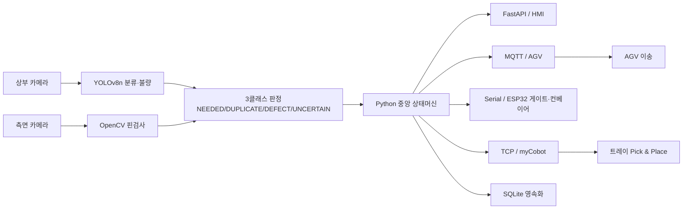
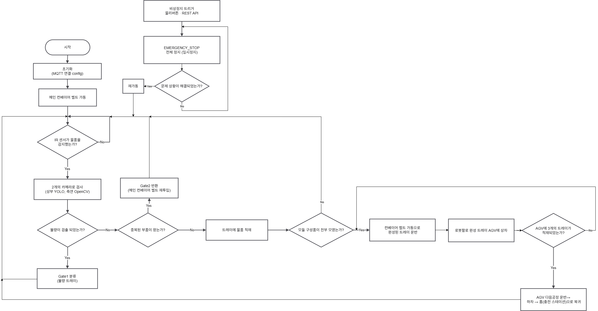

# VisiPick — 실시간 영상 분석 제품 자동 정렬·분류 시스템 (VisiPick)
> 비전 기반 불량 검사부터 로봇 Pick & Place, AGV 운송까지 검사→분류→이송 전 과정을 단일 상태머신으로 통합 제어하는 스마트 물류 자동화 시스템


## 📌 프로젝트 정보
| 항목 | 내용 |
|------|------|
| 개발 기간 | 2026.05 ~ 2026.08 |
| 팀 구성 | 5인 팀 프로젝트 |
| 담당 역할 | 시스템 설계 · 비전 검사 · 중앙 제어 상태머신 · 통신 아키텍처 · 로봇 제어 |
| 시연 영상 | [YouTube](https://youtu.be/rDrZn_7qteQ) |

## 🎯 프로젝트 개요
VisiPick는 멈추지 않고 흐르는(Non-stop) 컨베이어 위의 전자부품 4종을 두 대의 카메라로 실시간 검사하고, 레시피(특정 기판에 필요한 부품 조합)에 맞춰 자동으로 골라 모은 뒤, 로봇이 완성 트레이를 통째로 AGV에 실어 창고까지 운반하는 미니 스마트팩토리 셀입니다. 단순 양·불 분류를 넘어 "필요한 것만 골라 키팅" + "흐르는 채로(인라인) 검사"를 목표로 했습니다.

핵심은 검사부터 이송까지 흩어지기 쉬운 공정 단계를 Python 기반 단일 상태머신으로 묶어 일관되게 제어한 점이며, 이를 통해 다중 장비·다중 프로토콜 환경에서도 상태 충돌 없이 안정적으로 동작하도록 설계했습니다.

## ✨ 주요 기능 / 담당 업무
- **비전 검사 파이프라인**: YOLOv8n 추론과 OpenCV 측면 핀 검사를 결합해 부품을 분류하고 불량을 판정. 핀 개수, 핀 간격 변동계수(gap_cv), 정렬 편차(tip_y), 리드 휨(lean)을 기준으로 핀휨을 계측하고 DefectCode(`BENT_PIN`/`BROKEN`) 체계를 설계해 판정 결과를 코드화.
- **중앙 제어 상태머신**: Python 프로세스를 시스템 단일 상태 관리 주체(ISA-95 Level 1 Cell Controller, Single Source of Truth)로 두고 `IDLE → RUNNING → TRAY_TRANSFER → COMPLETE` 전 과정을 하나의 상태머신으로 통합 제어. 센서 트리거 기반 멀티프레임 검사, 게이트 지연 큐, 비상정지 일시정지화를 구현.
- **다중 프로토콜 통신 아키텍처**: HMI는 FastAPI(WebSocket/REST), AGV는 MQTT, ESP32 게이트·컨베이어는 USB Serial, myCobot은 Ethernet TCP/IP로 연동해 이기종 장비를 하나의 제어 흐름으로 통합. 데이터 성격별로 채널을 분리(제어 명령=REST, 상태 이벤트=MQTT, 영상=MJPEG).
- **로봇 제어 통합**: myCobot 280을 pymycobot `MyCobot280Socket`으로 제어하며, 트레이 자세 유지를 위한 교시 경로 재생, 0.05초 단위 보간 스트리밍, 2단 속도 제어, 소프트웨어 E-stop 경로를 구현해 안전성 확보.
- **백엔드 비전 엔진 이식**: 독립 동작하던 비전 엔진(상부 분류기 + 측면 핀검사 + 3클래스 판정)을 어댑터 패턴으로 FastAPI 백엔드에 접합해 단일 서비스로 통합.

## 🛠 기술 스택
### Software
- Python (YOLOv8n, OpenCV, PyTorch/TorchVision, pymycobot)
- C# WPF (.NET, MVVM, MahApps.Metro, LiveCharts2, EF Core, MQTTnet)
- FastAPI (REST + WebSocket)
- Mosquitto MQTT
- TCP/IP Socket
- SQLite (WAL)

### Hardware
- myCobot 280 Pi 로봇 팔
- Arduino / ESP32 (게이트·컨베이어)
- AGV (ESP32-CAM)
- 검사 카메라 2대 (상부·측면)

## 🔀 시스템 아키텍처

카메라 영상이 비전 엔진을 거쳐 판정되면 중앙 상태머신이 결과를 받아 HMI·AGV·게이트·로봇으로 제어 명령을 분배하고, 로봇 트레이 이재와 AGV 이송을 수행하며 모든 이력을 SQLite에 영속화합니다.

## 💻 핵심 코드 (담당 역할)

### 1. 3클래스 판정 로직 — `orchestrator/decision.py`
"불확실 ≠ 불량"을 코드로 구현한 부분입니다. 신뢰도가 낮거나 미검출인 부품을 폐기(REJECT)하지 않고 `UNCERTAIN`(반환 → 재투입)으로 분리해, 정상품을 한 번의 저신뢰 판정으로 버리지 않고 수율을 보호합니다.
```python
def evaluate(self, top: dict, side: dict) -> DecisionResult:
    part = top.get("part")
    conf = float(top.get("confidence", 0.0))
    hint = (top.get("verdict_hint") or "UNKNOWN").upper()
    pin_verdict = (side.get("verdict") or "UNKNOWN").upper()

    # 1) 저신뢰/미검출 -> UNCERTAIN (Gate1 반환 → 재투입)
    #    불량(폐기)이 아니라 '판단 보류'. 정상품을 저신뢰 한 번으로 버리지 않는다.
    if part is None or conf < self.min_conf:
        return DecisionResult(Verdict.UNCERTAIN, part, ...)

    # 2) 분류기가 reject 힌트 -> REJECT
    if hint == "REJECT":
        return DecisionResult(Verdict.REJECT, part, ...)

    # 3) 측면 핀 휨 -> REJECT
    if pin_verdict == "BENT":
        return DecisionResult(Verdict.REJECT, part, ...)

    # 4) 이미 수집한 부품 -> DUPLICATE
    if self.is_duplicate(part):
        return DecisionResult(Verdict.DUPLICATE, part, ...)

    # 5) 기본 -> PASS (양품 → 트레이 낙하)
    return DecisionResult(Verdict.PASS, part, ...)
```

### 2. 측면 핀 휨 정밀 계측 — `vision/pin_inspector.py`
핀 있는 부품(IC·터미널블록)의 핀 위치를 OpenCV로 추출해 휨을 판정합니다. 핀 개수, 간격 변동계수(gap_cv), 정렬 편차(polyfit 잔차)를 종합해 `NORMAL`/`BENT`/`UNKNOWN`을 가립니다. 전체 기울기는 무시하고 polyfit 잔차로 "혼자 어긋난 핀"만 잡아내는 점이 핵심입니다.
```python
def _verdict(self, xs, ys, part) -> PinResult:
    pin_count = len(xs)
    expected  = self.expected.get(part or "", 0)
    count_tol = self.pin_count_tolerance.get(part or "", 1)
    gap_mean = gap_cv = 0.0
    if pin_count >= 2:
        gaps    = np.diff(xs).astype(np.float32)
        gap_mean = float(gaps.mean())
        gap_cv  = float(gaps.std() / max(gap_mean, 1e-3))   # 간격 변동계수
    # y 정렬 편차: polyfit 잔차(전체 기울기는 무시, 혼자 어긋난 핀만 잡힘)
    if pin_count >= 3:
        a, b = np.polyfit(np.asarray(xs, np.float32), np.asarray(ys, np.float32), 1)
        tip_y_range = int(np.abs(ys - (a * xs + b)).max())
    verdict = "NORMAL"
    if expected and abs(pin_count - expected) > count_tol:
        verdict = "BENT"          # 핀 수 불일치
    if pin_count >= 2 and gap_cv > self.gap_tol:
        verdict = "BENT"          # 간격 불균일
    if tip_y_range > self.tip_y_tol:
        verdict = "BENT"          # 정렬 이탈
    return PinResult(verdict=verdict, pin_count=pin_count, gap_cv=gap_cv, ...)
```

### 3. 로봇 트레이 이재 — 보간 스트리밍 + 2단 속도 — `devices/robot.py`
끝점만 주면 이동 중 트레이가 기울어 부품이 쏟아지므로, 교시한 경유점 사이를 0.05초 단위 미세 설정점으로 잘게 나눠 연속 전송(보간 스트리밍)해 등속·부드럽게 움직입니다. 트레이를 쥔 구간은 속도를 낮춰 쏟김을 방지합니다.
```python
def _stream_to(self, start, target, deg_s, dt=0.05):
    """관절 보간 스트리밍 — start→target 미세 설정점을 dt 주기로 연속 전송(등속)."""
    cmd = min(100, max(10, int(deg_s * 1.5)))
    d = max(abs(a - b) for a, b in zip(start, target))
    n = max(1, int(d / (max(deg_s, 1.0) * dt)) + 1)
    # 스텝별 페이싱: 전송에 걸린 시간만 dt 에서 차감. 누적 시계 방식은 전송이 dt보다
    # 느릴 때 밀린 설정점을 한꺼번에 쏟아 로봇이 중간점을 건너뛰고 돌진 → 빚을 안 넘긴다.
    for k in range(1, n + 1):
        t0 = time.time()
        pt = [round(a + (b - a) * k / n, 2) for a, b in zip(start, target)]
        self._mc.send_angles(pt, cmd)
        remain = dt - (time.time() - t0)
        if remain > 0:
            time.sleep(remain)
```

## 🔧 기술적 도전과 해결 (Technical Challenges)

### Q1. 한 프레임만으로 판정하니 오검출이 잦았다
> **Challenge:** 흐르는 컨베이어 위 부품을 한 장의 프레임으로만 판정하면 그 순간의 각도·빛 반사·블러로 인해 오검출이 발생했습니다.
> **Solution:** 부품이 카메라 구간을 지나는 1초 동안 여러 프레임을 추론해 다수결로 판정하도록 변경했습니다. 불량은 단발성 오검출을 무시하기 위해 최소 프레임 수(`DEFECT_MIN_FRAMES`) 이상에서 잡혔을 때만 확정하고, 1~2개만 불량인 경우는 각도/노이즈 오검출로 보고 무시했습니다. 여러 관찰을 평균해 노이즈에 강건한 판정을 얻었습니다.

### Q2. 검사 결과가 실시간 화면보다 지연됐다
> **Challenge:** 카메라 드라이버가 이전 프레임을 버퍼에 쌓아두고 오래된 화면부터 내보내, 실가동 시 검사 결과가 실제 부품 위치보다 밀리는 문제가 있었습니다.
> **Solution:** 백그라운드 스레드로 최신 프레임만 유지하는 프레임 그래버를 도입하고 카메라 버퍼 크기를 1로 고정했습니다. 옛 화면을 버리고 항상 최신 1장으로만 검사해, 검사 시점과 실제 부품 위치를 일치시켰습니다.

### Q3. 로봇이 트레이를 옮기다 부품을 쏟았다
> **Challenge:** 집기·놓기 두 점만 주고 이동시키면 경로 중간에 트레이가 기울어 부품이 쏟아졌습니다. 또 TCP가 미세 설정점을 모았다 일괄 방출해 "멈췄다 훅" 튀는 떨림이 생겼습니다.
> **Solution:** 경유점을 직접 티칭해 경로 전체를 재생하도록 하고(자세 유지), 점 사이를 0.05초 단위 미세 설정점으로 보간 스트리밍해 등속으로 움직이게 했습니다. 떨림의 원인이던 Nagle 알고리즘은 `TCP_NODELAY`로 비활성화했고, 트레이를 쥔 구간은 속도를 낮추는 2단 속도로 쏟김을 막았습니다.

### Q4. 로봇 응답에 간헐적 지연 스파이크가 생겼다
> **Challenge:** myCobot Pi와의 TCP 통신에서 간헐적으로 큰 지연이 발생했습니다.
> **Solution:** 원인은 두 가지였습니다 — Pi의 WiFi 절전 기능이 무선칩을 재웠다 깨우는 것, 그리고 TCP가 소형 패킷을 모아 보내는 것. WiFi 절전을 끄고 `TCP_NODELAY`를 적용해 두 지연 원인을 모두 제거했습니다.

### Q5. 게이트 푸셔가 부품을 자꾸 빗나갔다
> **Challenge:** 부품마다 크기·중심이 달라 게이트 도달 타이밍이 어긋났고, 검사에 걸리는 시간(약 1초)이 매번 달라 발사 시점이 흔들렸습니다.
> **Solution:** 발사 시점을 `거리 ÷ 벨트 속도`로 물리 계산하고, 부품별 오프셋으로 미세 보정했습니다. 또 게이트 타이밍의 기준 시점을 검사 시작(부품이 카메라에 진입한 때)으로 잡아 검사 소요 시간과 무관하게 일정해지도록 했습니다. 이 타이밍이 속도에 수학적으로 묶이므로 벨트 속도는 런타임 변수가 아닌 커미셔닝 상수로 고정했습니다.

### Q6. 로봇 비상정지를 어떻게 안전하게 구현할 것인가
> **Challenge:** 일반적인 비상정지는 전원을 끊지만, myCobot은 12V 전원을 차단하면 중력으로 팔이 무너지고 SD 카드가 손상될 위험이 있었습니다.
> **Solution:** 전원 차단 대신 소프트웨어 레벨 정지 경로를 설계했습니다. 비전 시스템이 이상을 감지하면 중앙 서버가 소프트웨어 E-stop을 발동하고, 비상정지를 프로그램 종료가 아닌 "일시정지"로 처리해 진행 중이던 레시피·트레이 상태를 유지한 채 재개할 수 있게 했습니다.

## 📸 스크린샷

| 화면 | 설명 |
|------|------|
|  | 전체 공정 플로우차트 — 초기화·MQTT 연결부터 IR 센서 감지, 2개 카메라 검사(상부 YOLO·측면 OpenCV), 불량 Gate 분류, 트레이 적재, 로봇 AGV 상차, AGV 운반·충전 스테이션 복귀, 비상정지(EMERGENCY_STOP) 분기까지의 상태 흐름 |

## 🎬 시연 영상
[](https://youtu.be/rDrZn_7qteQ)
