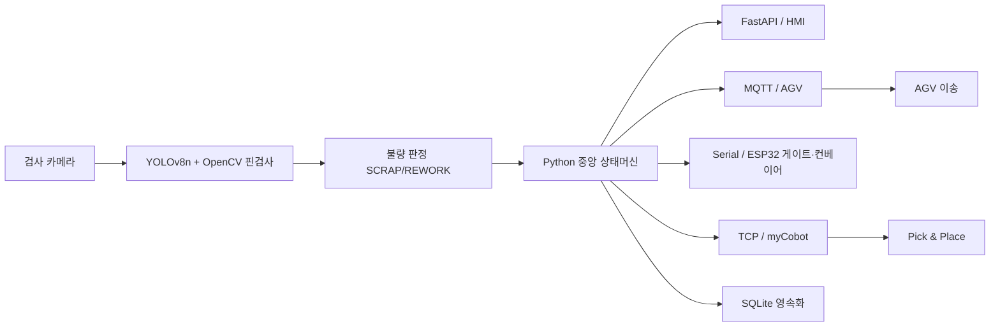

# VisiPick — 실시간 영상 분석 제품 자동 정렬·분류 시스템 (VisiPick)
> 비전 기반 불량 검사부터 로봇 Pick & Place, AGV 운송까지 검사→분류→이송 전 과정을 단일 상태머신으로 통합 제어하는 스마트 물류 자동화 시스템

## 📌 프로젝트 정보
| 항목 | 내용 |
|------|------|
| 개발 기간 | 2026.05 ~ 2026.08 |
| 팀 구성 | 4인 팀 프로젝트 |
| 담당 역할 | 비전 검사 · 중앙 제어 상태머신 · 통신 아키텍처 · 로봇 제어 |
| 시연 영상 | 준비 중 |

## 🎯 프로젝트 개요
VisiPick는 제조·물류 현장의 검사와 분류, 이송을 사람의 개입 없이 자동화하기 위해 개발한 스마트 물류 자동화 시스템입니다. 카메라로 입력된 영상을 실시간 분석하여 부품을 분류하고 불량을 판정한 뒤, 로봇 팔의 Pick & Place와 AGV 운송까지 연계해 처리합니다. 핵심은 검사부터 이송까지 흩어지기 쉬운 공정 단계를 Python 기반 단일 상태머신으로 묶어 일관되게 제어한 점이며, 이를 통해 다중 장비·다중 프로토콜 환경에서도 상태 충돌 없이 안정적으로 동작하도록 설계했습니다.

## ✨ 주요 기능 / 담당 업무
- **비전 검사 파이프라인**: YOLOv8n 추론과 OpenCV 핀 검사를 결합해 부품을 분류하고 불량(SCRAP/REWORK)을 판정. 신뢰도, 핀 개수, 핀 간격 편차(gap_cv)를 기준으로 결함 등급과 DefectCode 체계를 설계해 판정 결과를 코드화.
- **중앙 제어 상태머신**: Python 프로세스를 시스템 단일 상태 관리 주체(ISA-95 Level 1 Cell Controller)로 두고 검사→분류→이송 전 과정을 하나의 상태머신으로 통합 제어.
- **다중 프로토콜 통신 아키텍처**: HMI는 FastAPI(WebSocket/REST), AGV는 MQTT, ESP32 게이트·컨베이어는 USB Serial, myCobot은 Ethernet TCP/IP로 연동해 이기종 장비를 하나의 제어 흐름으로 통합.
- **로봇 제어 통합**: myCobot 280 Pi를 pymycobot으로 제어하며, 특이점 회피용 send_angles() 동작과 소프트웨어 E-stop 경로를 구현해 안전성 확보.
- **백엔드 비전 엔진 이식**: 독립 동작하던 비전 엔진을 어댑터 패턴으로 FastAPI 백엔드에 접합해 단일 서비스로 통합.

## 🛠 기술 스택
### Software
- Python (YOLOv8n, OpenCV, PyTorch/TorchVision, pymycobot)
- C# WPF (.NET, MVVM, MahApps.Metro, LiveCharts2, EF Core, MQTTnet)
- FastAPI (REST + WebSocket)
- Mosquitto MQTT
- TCP/IP Socket
- SQLite

### Hardware
- myCobot 280 Pi 로봇 팔
- Arduino / ESP32 (게이트·컨베이어)
- AGV
- 검사 카메라

## 🔀 시스템 아키텍처

카메라 영상이 비전 엔진을 거쳐 불량 판정되면 중앙 상태머신이 결과를 받아 HMI·AGV·게이트·로봇으로 제어 명령을 분배하고, 로봇 Pick & Place와 AGV 이송을 수행하며 모든 이력을 SQLite에 영속화합니다.

## 📸 스크린샷
> `images/` 폴더에 이미지를 추가한 뒤 아래 경로를 맞춰주세요.

| 화면 | 설명 |
|------|------|
|  | 비전 검사 결과 및 DefectCode 판정 화면 |
|  | HMI 대시보드 (실시간 공정 상태·차트 모니터링) |

## 🎬 시연 영상

